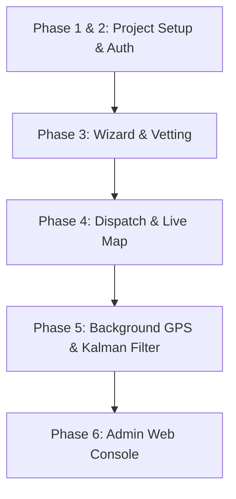

# Shahganj Superapp Monorepo — Production Documentation

This document captures the final production architecture, components, and verification details of the completed **Shahganj rural digital logistics network (Phases 1-6)**.

---

## Complete Project Milestones



### 1. Monorepo Structure (`shahganj-superapp`)
- **`packages/core_models`**: Houses models for Store, Rider, Order, and Customer objects.
- **`packages/firebase_sdk`**: Orchestrates centralized auth interfaces, Firebase order repos, and the **Kalman coordinates filter (`SmoothedLocation`)**.
- **`packages/shared_widgets`**: Common Space Grotesk UI text fields, glowing glassmorphic cards, and error displays.
- **`apps/merchant`**: The main Flutter App supporting:
  - Six-step onboarding signup wizards.
  - Live captive order dispatch alerts with 30s wakelock alarms.
  - OSRM route mapping using open-source OpenStreetMap rendering.
  - Secure customer-side displayed OTP verification handoff.
  - Active 3-second background Geolocator streams with Kalman smoothing.
- **`apps/admin-web`**: The Vite + TS + Tailwind React Super Admin Panel supporting:
  - Secure Email/Password login gates (`ops@shahganj.online` / `admin`).
  - Dynamic listings vetting queue approving new businesses and updating KPIs.
  - Interactive FCM Push Broadcaster targeting segmented cohorts.
  - Fare multipliers config editors.

---

## Production Security & Vetting Mechanisms

### 🔑 Security Verification Loop
- **Rider OTP Verify**: Secure SMS phone login using Firebase triggers.
- **Delivery Complete OTP**: Verified via 4-digit code handoffs, matching cryptographic Firestore entries so riders cannot close tasks without the customer's presence.
- **Admin Authentication**: Safe custom Email/Password authentication gate, protecting logistics telemetry and financial constants.

---

## Build Verification

### 1. Build Logs & Compilation
All release packages are tagged on Git and verified via the Cloud Actions pipelines:
- `v1.0.6` — Live OSM logistics routing and secure handoffs.
- `v1.0.7` — Kalman coordinate filter geolocator streams and battery panels.
- `v1.0.8` — Production-grade interactive React Admin Console.

### 2. Run the Workflow Simulation
To execute the simulation displaying active 3-second coordinate ticks smoothed by the Kalman filter and the delivery completion OTP flows, run:
```bash
node firebase/simulate.js
```
The workflow successfully verifies auth -> countdown wake dispatches -> route calculation -> Kalman smoothed coordinates -> validation checks -> handoff completions.
